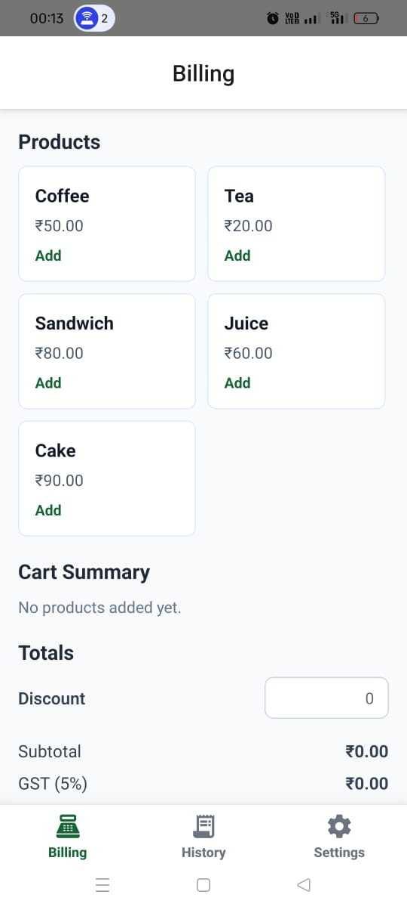
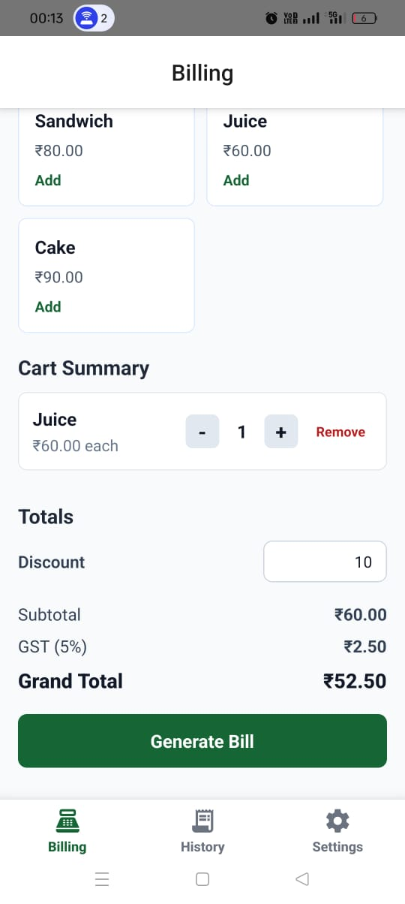
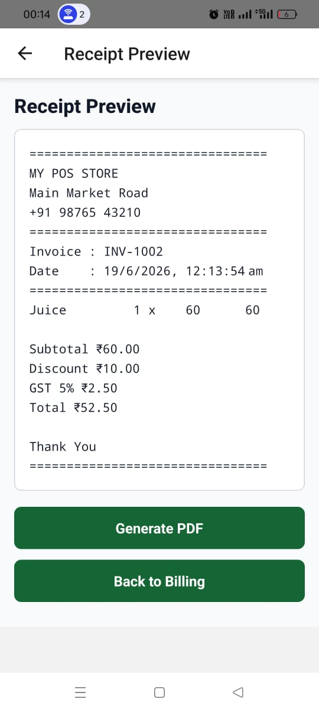
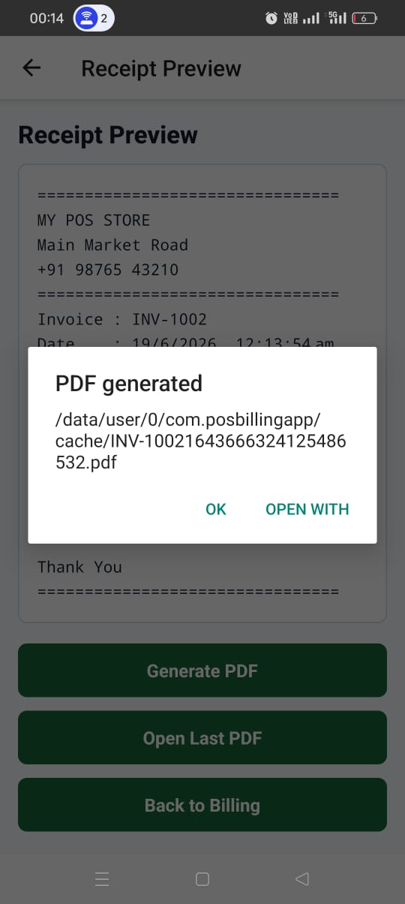
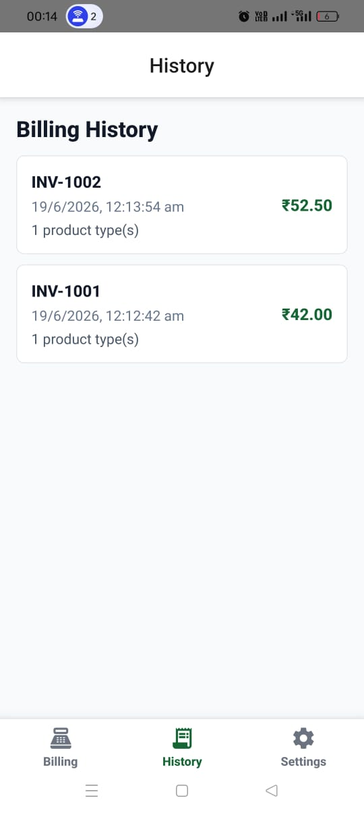
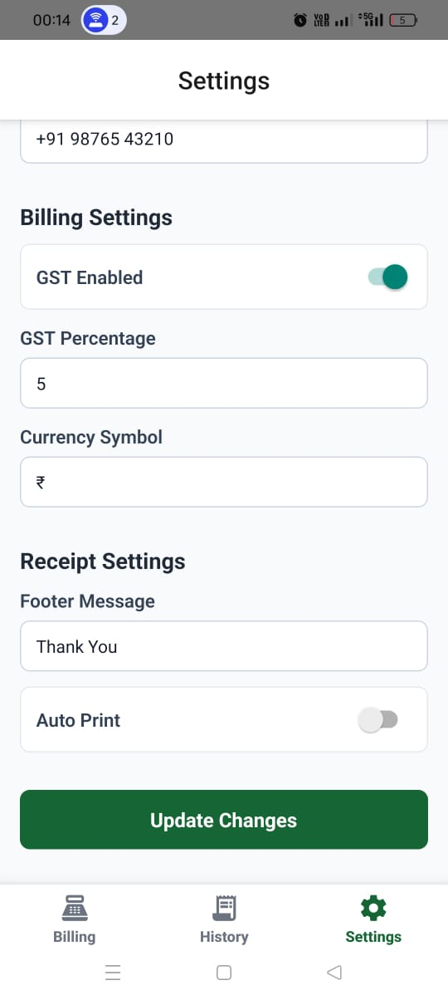
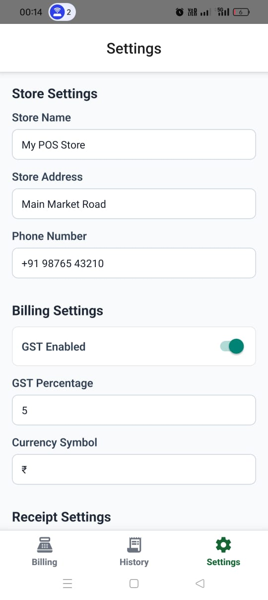

# PosBilling

<div align="center">


**A full-featured Point of Sale (POS) Billing Application built with React Native CLI, TypeScript, and Redux Toolkit.**

Generate invoices · Manage billing history · Preview & export PDF receipts · Configure store settings

</div>

---

##  Demo Video

<div align="center">

[]([https://drive.google.com/file/d/1Y5tUlM3GmgzcVTTxZ8AceSgmyapNobq-/view?usp=drive_link](https://drive.google.com/file/d/1m2m0YP-W5QiZNOMvxJmeP4EtPYnbh7Iz/view?usp=sharing))
</div>

> Click the button above to watch the full demo video of the app in action.
> https://drive.google.com/file/d/1m2m0YP-W5QiZNOMvxJmeP4EtPYnbh7Iz/view?usp=sharing

---

##  Download APK

<div align="center">

[](https://drive.google.com/file/d/1Y5tUlM3GmgzcVTTxZ8AceSgmyapNobq-/view?usp=drive_link)

</div>

---

##  Screenshots

<div align="center">

| Billing Screen (Empty) | Billing Screen (With Cart) |
|:---:|:---:|
|  |  |

| Receipt Preview | PDF Generation |
|:---:|:---:|
|  |  |

| Billing History | Invoice Details |
|:---:|:---:|
|  |  |

| Settings | |
|:---:|:---:|
|  | |

</div>

---

##  Features

###  Billing Module
- Add products from a predefined product list to the bill
- Increase or decrease product quantities
- Remove individual products from the bill
- Apply a bill-level discount
- Enable / disable GST and configure the GST percentage
- View real-time subtotal, GST amount, and grand total

**Sample Calculation:**
```
Coffee × 2 = ₹100
Tea    × 1 = ₹20
─────────────────
Subtotal     ₹120
GST (5%)     ₹6
─────────────────
Total        ₹126
```

###  Receipt Preview
- Auto-generated formatted receipt after billing
- Contains store name, invoice number, date & time, product list, quantities, tax info, grand total, and footer message
- PDF export via `react-native-html-to-pdf`
- Share / open PDF with any compatible Android app

###  Settings Module
- **Store Settings** — Store name, address, phone number
- **Billing Settings** — GST toggle, GST percentage, currency symbol
- **Receipt Settings** — Custom footer message, auto-print toggle
- All settings persisted locally with AsyncStorage and reflected app-wide

###  Billing History
- Stores all completed invoices locally
- Displays invoice number, date, and total amount
- Tap any invoice to re-open its full receipt preview

---

##  Architecture Overview

```
src/
├── components/      # Reusable UI building blocks
├── hooks/           # Typed Redux hooks
├── navigation/      # Stack and Bottom Tab navigation setup
├── screens/         # Billing, Receipt Preview, History, Settings
├── store/
│   ├── index.ts
│   ├── billingSlice.ts   # Cart, quantities, discounts, totals
│   ├── settingsSlice.ts  # Store info, GST config, receipt config
│   └── invoiceSlice.ts   # Invoice history and current invoice
├── types/           # Shared TypeScript interfaces
└── utils/           # Billing calculations, receipt formatting, sample products
```

### Redux Slices

| Slice | Manages |
|---|---|
| `billingSlice` | Cart items, product quantities, discounts, tax calculations, bill totals |
| `settingsSlice` | Store information, GST config, currency symbol, footer message, auto-print |
| `invoiceSlice` | Completed invoices, selected invoice, billing history |

---

##  Tech Stack

| Technology | Version | Purpose |
|---|---|---|
| React Native CLI | 0.86.0 | Mobile app framework |
| TypeScript | 5.8.3 | Type safety |
| Redux Toolkit | 2.12.0 | State management |
| React Redux | 9.3.0 | React bindings for Redux |
| React Navigation | 7.x | Screen navigation |
| AsyncStorage | 3.1.1 | Local data persistence |
| React Native Vector Icons | 10.3.0 | Tab and UI icons |
| React Native HTML to PDF | 1.3.0 | PDF receipt generation |
| React Native Share | 12.3.1 | Share / open PDF files |

---

##  Getting Started

### 1. Clone the Repository

```bash
git clone https://github.com/himanshugoyal2582003/PosBilling.git
cd PosBilling/POSBillingApp
```

### 2. Install Dependencies

```bash
npm install
```

### 3. Run on Android

```bash
# Start Metro bundler
npm start

# In a new terminal
npm run android
```

---

##  APK Build

```bash
cd android
gradlew assembleDebug
```

**Output:** `android/app/build/outputs/apk/debug/app-debug.apk`

---

##  Deliverables

- ✅ GitHub Repository
- ✅ README Documentation
- ✅ APK Build
- ✅ Application Screenshots
- ✅ Architecture Overview

---

## 📄 See Also

- [POSBillingApp README](./POSBillingApp/README.md) — detailed setup and usage guide
- [Architecture Overview](./POSBillingApp/Architecture%20Overview.md) — in-depth architecture documentation

---

<div align="center">

Made with ❤️ using React Native & Redux Toolkit

</div>
